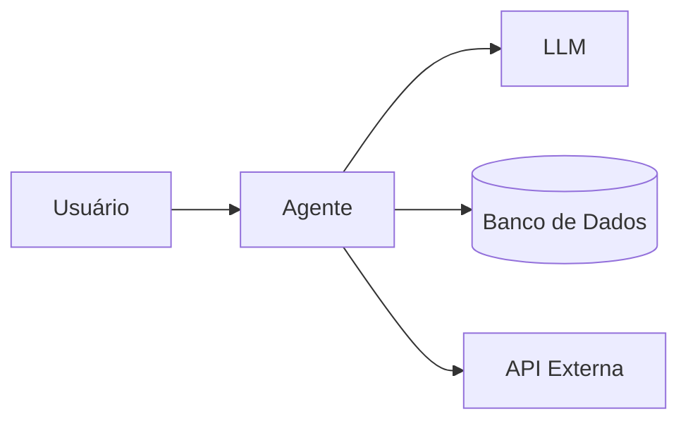

# 📘 Conceitos de IA

## Introdução

A Inteligência Artificial (IA) vem sendo aplicada em diferentes áreas para automatizar processos, analisar informações e apoiar a tomada de decisão. Com a popularização dos modelos generativos, conceitos como LLMs, RAG e Agentes de IA passaram a fazer parte da arquitetura de sistemas modernos.

Este documento apresenta uma visão geral desses conceitos sob uma perspectiva de engenharia de software, destacando aplicações práticas, responsabilidades arquiteturais e exemplos de uso.

---

# 🌐 Inteligência Artificial (IA)

A Inteligência Artificial é a área da computação dedicada à construção de sistemas capazes de executar tarefas que normalmente exigiriam capacidades humanas, como reconhecimento de padrões, interpretação de dados, aprendizado e tomada de decisão.

A IA é um termo abrangente que engloba diferentes disciplinas, incluindo:

- Machine Learning
- IA Generativa
- Visão Computacional
- Processamento de Linguagem Natural (NLP)

### Exemplos de Aplicação

- Sistemas antifraude
- Motores de recomendação
- Previsão de demanda
- Automação operacional
- Análise comportamental
- Assistentes inteligentes

---

# 📚 LLMs (Large Language Models)

LLMs são modelos treinados para compreender e gerar linguagem natural. Ferramentas como GPT, Claude e Gemini pertencem a essa categoria.

Esses modelos conseguem:

- Responder perguntas
- Resumir conteúdos
- Traduzir textos
- Gerar documentação
- Auxiliar no desenvolvimento de software
- Produzir conteúdo em linguagem natural

### Exemplo Prático

Um desenvolvedor pode utilizar um LLM para gerar documentação inicial de uma API:

```csharp
var documentation = await aiClient.GenerateAsync(
    "Crie uma documentação para o endpoint POST /usuarios"
);
```

Nesse cenário, o modelo está sendo utilizado apenas como gerador de conteúdo.

### Limitações

Por padrão, um LLM responde com base em:

- Dados aprendidos durante o treinamento
- Contexto enviado na conversa atual

Ele não possui acesso automático a sistemas corporativos, bancos de dados ou informações privadas.

---

# 🧠 RAG (Retrieval-Augmented Generation)

RAG é uma abordagem arquitetural que complementa LLMs com informações externas e atualizadas.

Antes de gerar uma resposta, o sistema recupera documentos relevantes e os adiciona ao contexto enviado ao modelo.

### Fluxo Simplificado

1. Usuário realiza uma pergunta
2. Sistema recupera documentos relevantes
3. Os documentos são enviados ao LLM
4. O modelo gera uma resposta contextualizada

### Exemplo Prático

Uma instituição financeira pode conectar um assistente às suas políticas internas de crédito.

Quando um analista pergunta:

> "Qual é o procedimento para aprovação de crédito empresarial?"

o sistema recupera os documentos corporativos relevantes antes de gerar a resposta.

### Principais Benefícios

- Respostas mais atualizadas
- Menor risco de alucinações
- Uso de conhecimento corporativo
- Maior confiabilidade

---

# 🧑‍💻 Agentes de IA

Agentes de IA expandem as capacidades dos LLMs ao adicionar:

- Memória
- Contexto
- Ferramentas
- Orquestração
- Capacidade de execução

Enquanto um LLM normalmente gera respostas, um agente pode executar tarefas completas utilizando sistemas externos.

### Exemplo Prático

Considere um agente responsável por acompanhar falhas de deploy:

1. Detecta falha no pipeline
2. Consulta logs
3. Identifica possíveis causas
4. Abre incidente
5. Notifica a equipe

Nesse cenário o agente participa ativamente do processo operacional.



---

# 🏗️ Arquitetura de um Agente de IA

Um sistema agentic normalmente é composto pelos seguintes elementos:

| Componente | Responsabilidade |
|------------|-----------------|
| LLM | Interpretação e raciocínio |
| Orquestração | Coordenação do fluxo |
| Memória | Persistência de contexto |
| Ferramentas | Integração com sistemas externos |
| Estado | Controle da execução |
| Validação | Segurança e qualidade das saídas |

O modelo de linguagem é apenas uma das peças da arquitetura. A confiabilidade do sistema depende da integração adequada entre todos os componentes.

---

# ▶️ Fluxo de Execução

O fluxo operacional de um agente normalmente segue as etapas:

1. Interpretação da solicitação
2. Construção do contexto
3. Planejamento
4. Execução
5. Validação
6. Resposta final

Compreender esse ciclo é fundamental para observabilidade e diagnóstico.

---

# 🧩 Context Engineering

Context Engineering é a disciplina responsável por definir como o contexto será construído e entregue ao modelo.

| Elemento | Finalidade |
|-----------|------------|
| Instruções | Regras de comportamento |
| Histórico | Conversas anteriores |
| Memória | Conhecimento persistente |
| RAG | Documentos recuperados |
| Estado | Situação atual da tarefa |

Mais contexto nem sempre significa melhores resultados.

O objetivo é fornecer informações relevantes, organizadas e priorizadas para a tarefa em execução.

---

# ⚖️ Separação de Responsabilidades: LLM vs Código

Uma das decisões arquiteturais mais importantes em sistemas com IA é definir o que deve ser responsabilidade do modelo e o que deve permanecer no código.

| Componente | Responsabilidade |
|------------|------------------|
| LLM | Interpretação, síntese e geração de conteúdo |
| Código | Regras de negócio, validações e segurança |

### Exemplo

❌ Incorreto

```csharp
var resposta = await llm.GenerateAsync(
    "O usuário pode aprovar uma operação de R$ 100.000?"
);
```

✅ Correto

```csharp
if(usuario.LimiteAprovacao < 100000)
{
    throw new UnauthorizedAccessException();
}
```

O modelo pode explicar a decisão, mas a regra de negócio deve permanecer em componentes determinísticos.

---

# 📡 Observabilidade

Observabilidade é a capacidade de compreender o comportamento interno do sistema a partir dos sinais produzidos durante sua execução.

| Pilar | Objetivo |
|---------|----------|
| Logs | Eventos detalhados |
| Métricas | Performance e custo |
| Traces | Fluxo completo da execução |

Em aplicações com agentes, também é importante monitorar:

- Contexto enviado ao modelo
- Ferramentas utilizadas
- Decisões intermediárias
- Custos por execução

---

# 🧪 Instrumentação

Instrumentação é o processo de registrar eventos relevantes durante a execução.

| Informação | Exemplo |
|------------|----------|
| Input | Solicitação do usuário |
| Prompt | Versão utilizada |
| Contexto | Dados recuperados |
| Ferramentas | Chamadas realizadas |
| Latência | Tempo de execução |
| Saída | Resposta final |

Sem instrumentação adequada, a observabilidade torna-se limitada.

---

# 🔍 Diagnóstico de Falhas

Falhas em sistemas agentic podem ocorrer em diferentes camadas.

| Problema | Descrição |
|-----------|-----------|
| Alucinação | Informação incorreta apresentada como verdadeira |
| Tool Misuse | Uso inadequado de ferramentas |
| Perda de Contexto | Informações relevantes descartadas |
| Loops | Execução sem convergência |
| Latência | Tempo excessivo de resposta |

O diagnóstico exige análise do fluxo completo e não apenas da resposta final.

---

# 🛡️ Engenharia de Confiabilidade

Confiabilidade consiste em construir sistemas resilientes e previsíveis.

Práticas comuns:

- Retries
- Timeouts
- Circuit Breakers
- Fallbacks
- Validação de saídas

Um agente inteligente sem mecanismos de confiabilidade continua sendo um risco operacional.

---

# 📊 Indicadores de Saúde

Além de métricas tradicionais, sistemas com IA costumam acompanhar:

| Indicador | Objetivo |
|------------|-----------|
| Taxa de Sucesso | Qualidade das execuções |
| Latência | Tempo de resposta |
| Custo | Consumo financeiro |
| Tool Accuracy | Uso correto de ferramentas |
| Consistência | Estabilidade das respostas |
| Satisfação | Experiência do usuário |

Esses indicadores ajudam a transformar percepções subjetivas em dados mensuráveis.

---

# ⚔️ LLM vs Agentes de IA

| Aspecto | LLM | Agente |
|----------|------|---------|
| Objetivo | Linguagem natural | Execução de tarefas |
| Memória | Limitada | Persistente |
| Ferramentas | Limitadas | Integradas |
| Autonomia | Baixa | Alta |
| Complexidade | Menor | Maior |
| Custo | Menor | Maior |

---

# 💰 Custos e Complexidade

LLMs normalmente apresentam menor custo operacional e menor complexidade arquitetural.

Agentes introduzem:

- Memória persistente
- Integrações externas
- Observabilidade avançada
- Orquestração
- Governança operacional

Por esse motivo, muitas organizações iniciam com assistentes baseados em LLMs antes de evoluírem para arquiteturas agentic.

---

# 🎯 Conclusão

A adoção de IA em ambientes corporativos não substitui princípios tradicionais de arquitetura de software. Pelo contrário, conceitos como separação de responsabilidades, observabilidade, confiabilidade e governança tornam-se ainda mais importantes à medida que modelos de linguagem e agentes passam a fazer parte das aplicações.

Compreender a diferença entre LLMs, RAG e Agentes é o primeiro passo para projetar sistemas inteligentes que possam evoluir de forma sustentável, segura e observável em ambientes de produção.
